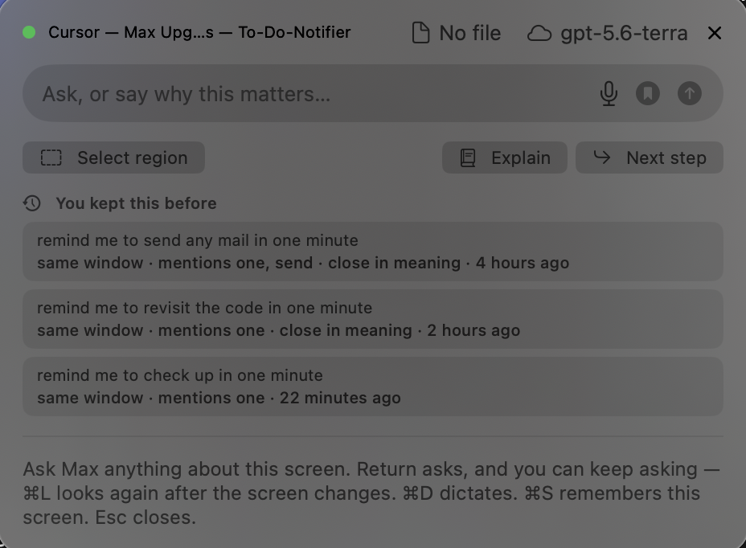
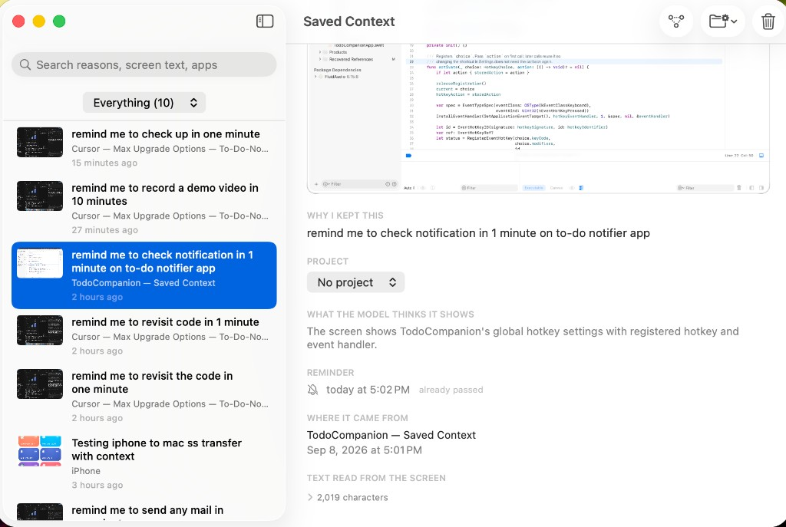
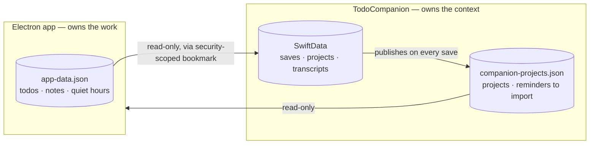
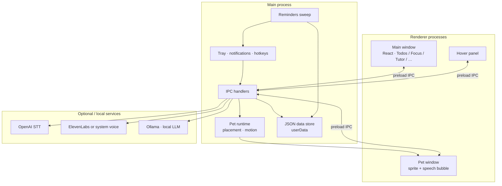

# To-Do Notifier

**Two macOS apps for studying: one that tracks the work, one that remembers the context.**

[](https://github.com/Surya7612/To-do-notifier/actions/workflows/ci.yml)

This repository holds two separate macOS apps that share a single task list. One is about **doing the
work**; the other is about **remembering what you were looking at while you did it**.

---

## The two apps, in plain terms

### To-Do Notifier — the study app

An Electron desktop app for the actual work: what you have to do, when it is due, and staying on it.
This is where a task is created, worked on, and ticked off.

| Feature | What it does |
| --- | --- |
| **Todos** | Due dates, with menu bar and notification nags both *before* a task is due and after it is overdue |
| **Focus** | A pomodoro timer, with optional ambient sound |
| **Study** | Notes and flashcards, generated from whatever you just said or typed |
| **Tutor** | "Rubber Duck" mode: explain a topic out loud and get probing questions back |
| **Voice** | Talk to it with **⌘G** — spoken commands and short chat about your open work |
| **Pet** | A desktop sprite that wanders your screen and occasionally nags you |
| **Quiet hours** | One do-not-disturb window that *both* apps respect |

### TodoCompanion — the screen companion

A native Swift menu bar app. Press a hotkey and it screenshots your displays, reads them with on-device
OCR, and answers a question about whatever you are looking at. It also keeps screens you want to come
back to, filed under **your own stated reason** for keeping them. This is the part under active
development, and it has [its own README](TodoCompanion/README.md).

| Feature | What it does |
| --- | --- |
| **Ask about your screen** | `⌃⌥Space` captures every display and answers a question about it; `⌘R` narrows it to a region you drag out |
| **Keep asking** | Follow-ups remember the conversation, and `⌘L` re-reads the screen when it has changed |
| **Talk to it** | `⌥⌘Q` twice opens the mic (no Accessibility); opt-in Tab+Q does the same when granted |
| **Point at things** | It draws a box around the control it just named — on your real screen, not in the panel |
| **Teach me** | Walks a screen a step at a time, boxing and captioning each step as it reads it aloud |
| **Keep a screen** | `⌘S` saves the screenshot with your reason for keeping it, plus `#tags` and a project |
| **Find it again** | Search the library by words or by meaning, or browse it as a graph of what connects to what |
| **Remind me** | "Remind me in two hours" becomes a notification *and* a real task in the study app |
| **From your phone** | An iOS Shortcut drops captures into an iCloud folder and the Mac picks them up |
| **Local by default** | Ollama answers on-device; OpenAI is opt-in and only ever for questions you asked |

### How they fit together

They are two products sharing one task list, not two versions of the same thing. The seam is *study
and motivation* versus *context and memory*. Merging them was considered and rejected — see [the design
document](docs/PLAN.md).

Each app owns one file and reads the other's, and **neither ever writes the other's**. So a project you
create in the companion appears in the study app as a label on the tasks you put in it, and a reminder
you ask the companion for turns into a real task you can tick off.

The rule the companion is built around, and the reason most of its architecture looks the way it does:
**what you said and what a model inferred are never allowed to blur.** Your reason for keeping
something is stored verbatim and never overwritten, a model's summary is always labelled as one, and
anything it resurfaces says why — `same window`, `#tag`, `close in meaning`.

---

## Screenshots

**TodoCompanion** — summoned by a hotkey over whatever you are looking at. Under **You kept this
before** it volunteers what you already saved that relates to this screen, and every item states
*why* it surfaced: `same window`, `mentions one, send`, `close in meaning`. Nothing reaches that list
carrying a score it cannot explain, which is the constraint the embedding signal had to be fitted
into rather than around — a vector distance may only *contribute* to a score it can also justify.



The library is the other half — what you kept, paired with why you kept it. Your reason is verbatim
under **Why I kept this**; the model's reading of the screen sits below it under its own heading,
labelled as inference and never substituted for your words.



**The Electron app** — todos with lead-time and overdue nags, the pomodoro timer, and Rubber Duck
voice tutoring.

| Todos & reminders | Focus (Pomodoro) |
| --- | --- |
|  |  |


---

## Architecture

Two applications, one shared task list, and a deliberate rule about who is allowed to write what.

### The bridge between them

Each app owns one file and reads the other's, and **neither ever writes the other's**. That constraint
is the reason projects work at all: `app-data.json` is held in memory and rewritten wholesale by the
Electron process, with no locking available between two separate applications, so the companion
publishes its own file rather than editing that one.



So a project created in the companion appears here as a label and filter on the tasks you put in it,
and a task deleted here simply stops resolving over there.

Reminders cross the same way, and it is worth being precise about how. Saying "remind me to text voice
bugs at 10" to the companion creates a **real task here**, completable like any other — but the
companion does not create it. It publishes the request, and this app, which owns `app-data.json`, makes
the task itself. Importing rather than mirroring is the whole point: a read-only list would have looked
identical and could not have been ticked off. The announcing stays with the companion, which scheduled
a notification when the reminder was set, so this app's nag sweep skips those tasks and one thing pings
once.

Both apps notify locally, which means a due task needs this Mac awake to reach you. The companion can
optionally copy dated tasks into an **iCloud Reminders list**, and Apple then delivers them to an
iPhone or Watch whether the Mac is on or not — no server, nothing to pay for. Off by default; see the
companion's README for what it does and does not promise.

### Inside the Electron app

See [docs/ARCHITECTURE.md](docs/ARCHITECTURE.md) for module boundaries and IPC.



**Voice path (conversation):** mic → OpenAI transcription → intent / companion chat (Ollama) → TTS → pet bubble + half-duplex mic pause.

**Tutor path (Rubber Duck):** dictate transcript → “ask me” / Ask Goku → Ollama question or tip → speak.

Main-process code is CommonJS (`.cjs`) for straightforward Electron packaging; the UI is TypeScript + React.

---

## Design decisions

The [design document](docs/PLAN.md) records what was rejected alongside what
was built, because on this project the rejections carry most of the reasoning.

| Considered | Decided against, because |
| --- | --- |
| Merging the two apps into one | ~7,500 lines of working code, and the result would have a split personality. They divide along *study and motivation* versus *context and memory*, which is a real seam. |
| A graph database (Neo4j) for connections | The edges already exist in SwiftData — a save has a project, tags, and a source app. A server and a query language would add no edge. What was missing was a way to *see* them, so the graph is a rendered view. |
| Requiring Accessibility for basic use | Cuts first-run friction. Carbon hotkeys and OCR pointing work with no grant. Tab+Q and Move pointer / Click are an **opt-in** extras switch. |
| Continuous or background screen capture | Capture is always explicit and user-initiated. This is the property that makes the app safe to leave running. |
| A cloud model doing background work | A hosted model may answer a question you deliberately asked, and may never work unprompted. Enforced structurally: `summarize` and `embed` exist only on the local provider, so a cloud one cannot be wired to them. |
| An autonomous coding agent | It sees a screenshot, has no file tree, and cannot run your tests, so it would be strictly worse than the editor you already have open. It proposes one file, shows a diff, and writes only on a button press. |
| An iCloud container for phone capture | Needs an entitlement requiring the paid Apple Developer Program. A *folder* inside iCloud Drive needs none and syncs identically. |
| A wake word | An always-hot microphone sits badly beside explicit capture. The Electron app has one and ships it **off** by default, which is the evidence rather than the counter-example. The companion's `⌥⌘Q` ×2 is not one either: nothing listens until it is pressed twice, and a shortcut is you opening the mic. |
| Boxing whatever an answer seems to mention | Drawing on your screen is a confident claim about your pixels. The box appears on a button that names its match first — and when it follows the spoken answer instead, it is restricted to labels Max quoted character for character, so what gets drawn is something stated rather than something inferred. |
| A lesson format with coordinates in it | A taught step is an ordinary numbered answer, parsed by the code that already draws numbered lists. Max names things and the OCR boxes decide the pixels, so a reply that ignored the instructions is still a good answer rather than a broken mode. An arrow is drawn only where Max wrote one; two labels in one step is not a claim that one becomes the other. |

---

## Stack

- **Desktop:** Electron 34 (main / tray / pet windows)
- **UI:** React 19 + Vite + TypeScript
- **Local AI:** Ollama HTTP API
- **Speech:** OpenAI transcription; ElevenLabs or macOS system voice
- **Storage:** local `app-data.json` under Application Support (not in git)
- **Quality:** ESLint, Vitest, `npm run check` (typecheck + lint + test + build)

The native companion is Swift 6 + SwiftUI with ScreenCaptureKit, Vision, SwiftData, and Speech,
tested with Swift Testing. Its [README](TodoCompanion/README.md) covers building it.

---

## Requirements

- macOS (Apple Silicon primary)
- Node.js 18+ — and Xcode 16+ if you want to build the native companion too
- [Ollama](https://ollama.com) + a model (`ollama pull llama3.2`)
- OpenAI API key (listening / STT) — set in **Settings**, not in the repo
- Optional: ElevenLabs API key + **My Voices** voice ID

---

## Download (recommended)

**One DMG, both apps.** Grab the latest suite release:

**[Download To-Do Notifier + Max](https://github.com/Surya7612/To-do-notifier/releases/latest)**

1. Open the DMG and drag **To-Do Notifier** and **TodoCompanion** to Applications.
2. Launch both. In Max → Settings, link your To-Do Notifier data file so tasks and projects connect.
3. Grant Screen Recording for Max; Microphone (and Speech Recognition) if you use voice.
4. For Max, run [Ollama](https://ollama.com) locally (`ollama serve`) with a model pulled.

Source stays open (MIT). Suite releases are additive — older tags such as `companion-v0.1` remain available.

Building from source (contributors) is below.

---

## Install from source

### Electron app (To-Do Notifier)

```bash
npm install
npm run install:app   # packs, ad-hoc signs, installs to /Applications
```

DMG alone: `npm run dist` → open `release/*.dmg` (local/ad-hoc; prefer the suite release above for Gatekeeper-clean installs).

The companion is a separate Xcode build — see [its README](TodoCompanion/README.md#running-it). Everything from here to
[Development](#development) is the Electron app; the two do not share a toolchain.

### First launch

1. Allow **Microphone** and **Notifications**.
2. **Settings → Voice** → paste OpenAI key (and ElevenLabs if you use it).
3. Run **Readiness** check; fix any red items.
4. **⌘G** to talk, **Esc** to stop.

---

## Voice modes (Electron app)

The companion's voice is separate and stricter — both dictation and speech stay on the machine there,
where this app uses hosted transcription. See [its README](TodoCompanion/README.md).

| Mode | Enter | Exit | Role |
| --- | --- | --- | --- |
| Conversation | ⌘G / tray Talk | Esc | Commands + short chat |
| Rubber Duck | Tutor → Start listening | Esc / Stop | Explain; say **ask me** for a probe/tip |
| Wake word | Settings (off by default) | Disable setting | Optional always-armed wake phrase |

---

## Development

```bash
npm install
env -u ELECTRON_RUN_AS_NODE npm run dev
npm run check
```

| Script | Purpose |
| --- | --- |
| `npm run dev` | Vite + Electron |
| `npm test` | Vitest |
| `npm run pack` / `dist` | Unpackaged `.app` / DMG (local) |
| `npm run install:app` | Install to `/Applications` |
| `./scripts/release-suite.sh` | Family DMG (both apps), notarized GitHub release |

### Tests

CI runs the Electron suite on pushes to `main` and on pull requests. The companion's suite is run
locally, deliberately: it targets a macOS release newer than GitHub's runners provide, so putting it
in the workflow could only ever produce a failure that says nothing about the code.

```bash
npm test                                                    # Electron — Vitest
cd TodoCompanion && xcodebuild test \
  -project TodoCompanion.xcodeproj -scheme TodoCompanion \
  -destination 'platform=macOS'                             # companion — Swift Testing
```

The companion's suite covers pure logic only — no screen, no microphone, no model, no network — so it
runs in well under a second. `electron/lib/companionProjects.test.ts` and `ProjectExportTests` are the
two halves of the same cross-language contract, pinning the published JSON's keys on one side and
every shape of bad input on the other, since neither language compiles against the other.
`electron/lib/companionTasks.test.ts` covers the reminder import, where a mistake is persisted and
compounding rather than wrong once — adding the same task on every tick, or resurrecting one already
completed — and `electron/lib/remindersService.test.ts` pins that an imported reminder is announced by
the companion and not a second time here.

---

## Privacy

- Todos, notes, and settings stay in local JSON under Application Support.
- With voice on, mic audio goes to **OpenAI** for STT.
- Spoken replies may use **ElevenLabs** if configured.
- API keys belong in Settings (or optional `.env` locally) — never commit them. See `.env.example`.
- The native companion is stricter and has [its own posture](TodoCompanion/README.md#privacy-posture): no cloud transcription, no analytics, no background capture, and no background work routed to a cloud model.

---

## License

- **Source code:** [MIT](LICENSE)
- **Pet and tutor artwork:** not under MIT — third-party fan art, used here as personal demo art only. See [docs/ASSETS.md](docs/ASSETS.md).
- `"private": true` in `package.json` only means the package is not published to npm. The source is public under MIT.
