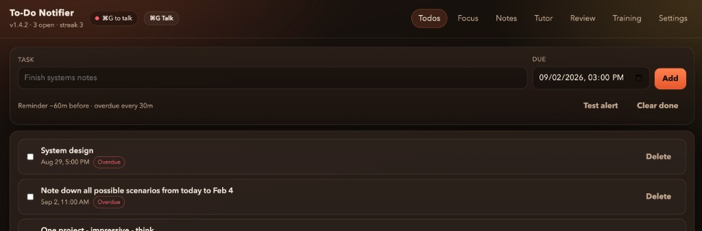
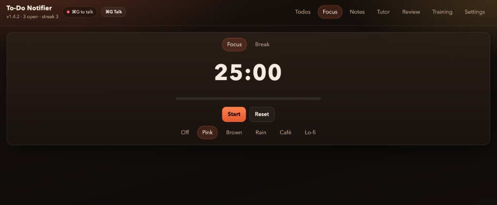
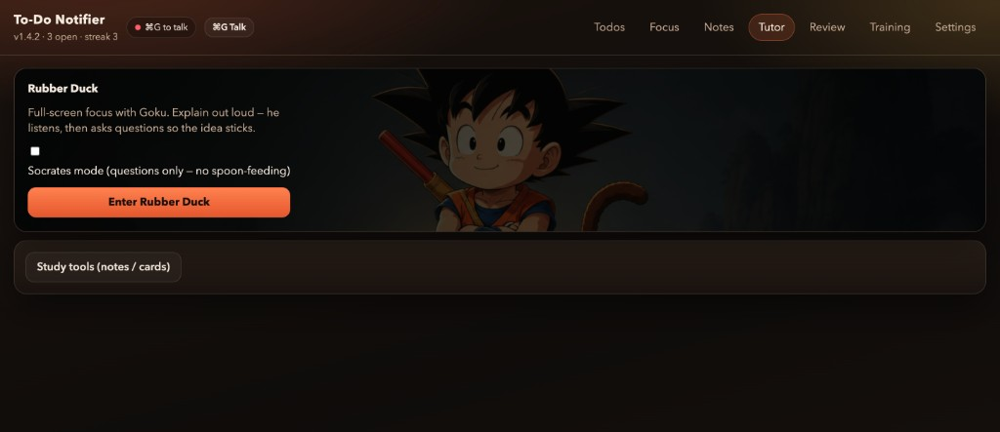
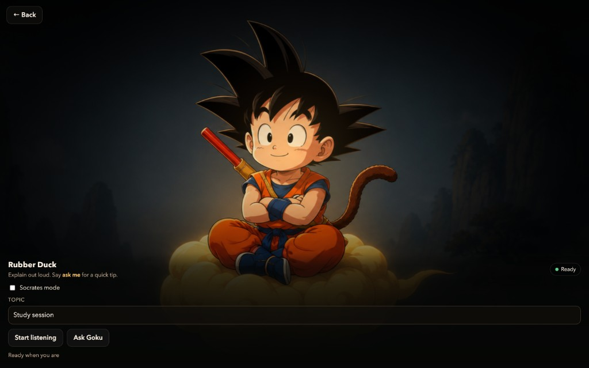
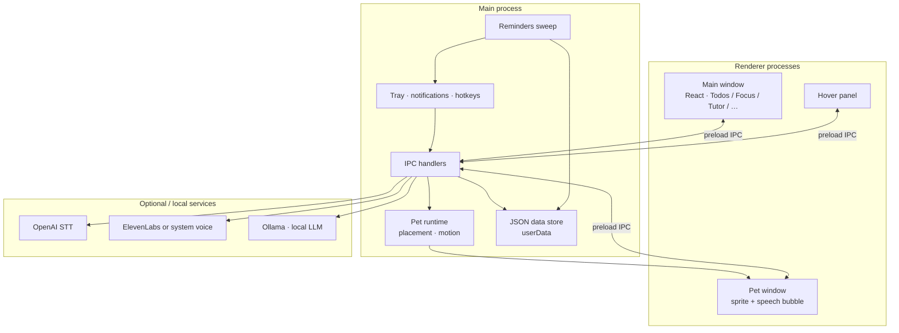

# To-Do Notifier

**macOS productivity companion with voice chat and local AI tutoring.**

Desktop app (Electron) for todos, focus sessions, and Rubber Duck study mode — with a floating companion pet, tray reminders, and on-demand voice (OpenAI STT + local Ollama).

[](https://github.com/Surya7612/To-do-notifier/actions/workflows/ci.yml)

---

## Screenshots

| Todos & reminders | Focus (Pomodoro) |
| --- | --- |
|  |  |

| Tutor entry | Rubber Duck (voice tutoring) |
| --- | --- |
|  |  |

---

## What it does

| Area | Behavior |
| --- | --- |
| **Todos** | Due dates, lead-time + overdue nags via menu bar and notifications |
| **Focus** | Pomodoro timer with optional ambient sound |
| **Companion** | Always-on Goku pet (drag anywhere; corner / perch / body-double modes) |
| **Voice** | **⌘G** talk / **Esc** stop — commands + short chat over open work |
| **Tutor** | Rubber Duck mode: explain out loud; optional Socrates probing questions |
| **Study** | Notes + flashcards generated from what you said or typed |
| **Local AI** | Ollama for tutoring / companion replies; data stored on-disk |

---

## Architecture

High-level process layout. See [docs/ARCHITECTURE.md](docs/ARCHITECTURE.md) for module boundaries and IPC.



**Voice path (conversation):** mic → OpenAI transcription → intent / companion chat (Ollama) → TTS → pet bubble + half-duplex mic pause.

**Tutor path (Rubber Duck):** dictate transcript → “ask me” / Ask Goku → Ollama question or tip → speak.

---

## Stack

- **Desktop:** Electron 34 (main / tray / pet windows)
- **UI:** React 19 + Vite + TypeScript
- **Local AI:** Ollama HTTP API
- **Speech:** OpenAI transcription; ElevenLabs or macOS system voice
- **Storage:** local `app-data.json` under Application Support
- **Quality:** ESLint, Vitest, `npm run check` (typecheck + lint + test + build)

---

## Requirements

- macOS (Apple Silicon primary)
- Node.js 18+
- [Ollama](https://ollama.com) + a model (`ollama pull llama3.2`)
- OpenAI API key (listening / STT)
- Optional: ElevenLabs voice ID

---

## Install

```bash
npm install
npm run install:app   # packs, ad-hoc signs, installs to /Applications
```

DMG: `npm run dist` → open `release/*.dmg`.

### First launch

1. Allow **Microphone** and **Notifications**.
2. **Settings → Voice** → paste OpenAI key.
3. Run **Readiness** check; fix any red items.
4. **⌘G** to talk, **Esc** to stop.

---

## Voice modes

| Mode | Enter | Exit | Role |
| --- | --- | --- | --- |
| Conversation | ⌘G / tray Talk | Esc | Commands + short chat |
| Rubber Duck | Tutor → Start listening | Esc / Stop | Explain; say **ask me** for a probe/tip |
| Wake word | Settings (off by default) | Disable setting | Optional always-armed “Hey Goku” |

---

## Development

```bash
npm install
env -u ELECTRON_RUN_AS_NODE npm run dev
npm run check
```

| Script | Purpose |
| --- | --- |
| `npm run dev` | Vite + Electron |
| `npm test` | Vitest |
| `npm run pack` / `dist` | Unpackaged `.app` / DMG |
| `npm run install:app` | Install to `/Applications` |

---

## Privacy

- Todos, notes, and settings stay in local JSON.
- With voice on, mic audio goes to **OpenAI** for STT.
- Spoken replies may use **ElevenLabs** if configured.
- API keys live in Settings (`app-data.json`) — never commit them.

---

## License

MIT — see [LICENSE](LICENSE).
