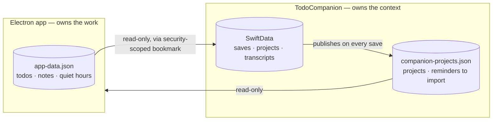
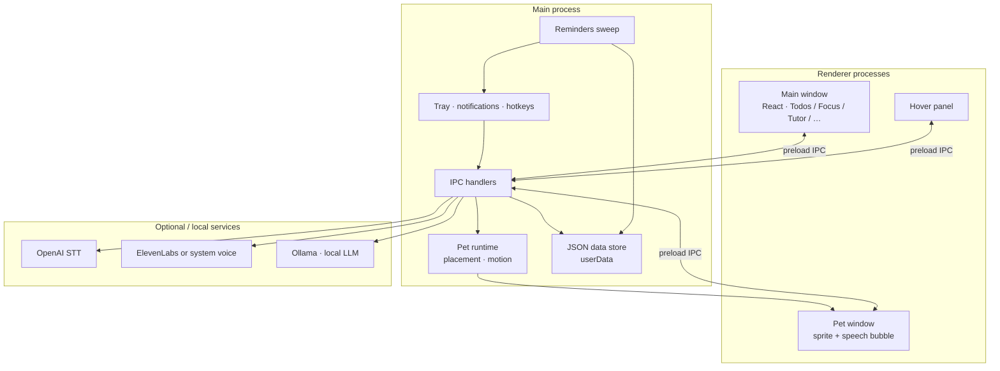

# To-Do Notifier

**Two macOS apps for studying: one that tracks the work, one that remembers the context.**

An Electron desktop app for todos, focus sessions, and Rubber Duck study mode — plus **TodoCompanion**, a native Swift menu bar app that answers questions about what is on your screen and keeps things with your own stated reason for keeping them. They share a task list and nothing else.

[](https://github.com/Surya7612/To-do-notifier/actions/workflows/ci.yml)

> `"private": true` in `package.json` means the package is **not published to npm**. The app source is public under MIT (see [License](#license)).

---

## Two apps in this repository

| | |
| --- | --- |
| **This app** (`electron/`, `src/`) | Where work is **created and completed**: todos, notes, flashcards, streaks, the pomodoro timer, the pet, and notification preferences. |
| **[TodoCompanion](TodoCompanion/README.md)** (`TodoCompanion/`) | A native Swift menu bar app where context is **captured and connected**: it answers questions about what is on screen, remembers things with your stated reason for keeping them, finds them again by words or meaning, and accepts captures from your phone. Active development. |

They are separate products sharing one task list, not two versions of the same thing. Merging them was considered and rejected — see [the design document](docs/TO_DO_NOTIFIER_UPDATED_PLAN.md).

Each owns one file and reads the other's, and **neither writes the other's**. The companion reads this app's `app-data.json` for open tasks, notes, and quiet hours; this app reads the companion's project list to label and filter its own task list. So a project you create in the companion shows up here on the tasks you put in it.

---

## Screenshots

| Todos & reminders | Focus (Pomodoro) |
| --- | --- |
|  |  |


---

## What the Electron app does

The native companion has [its own README](TodoCompanion/README.md).

| Area | Behavior |
| --- | --- |
| **Todos** | Due dates, lead-time + overdue nags via menu bar and notifications; project labels and filter from the companion, and reminders it asked to be turned into tasks |
| **Focus** | Pomodoro timer with optional ambient sound |
| **Companion** | Always-on desktop pet (drag anywhere; corner / perch / body-double modes) |
| **Voice** | **⌘G** talk / **Esc** stop — commands + short chat over open work |
| **Tutor** | Rubber Duck mode: explain out loud; optional Socrates probing questions |
| **Study** | Notes + flashcards generated from what you said or typed |
| **Local AI** | Ollama for tutoring / companion replies; data stored on-disk |

---

## Architecture

Two applications, one shared task list, and a deliberate rule about who is allowed to write what.

### The bridge between them

Each app owns one file and reads the other's, and **neither ever writes the other's**. That constraint
is the reason projects work at all: `app-data.json` is held in memory and rewritten wholesale by the
Electron process, with no locking available between two separate applications, so the companion
publishes its own file rather than editing that one.



So a project created in the companion appears here as a label and filter on the tasks you put in it,
and a task deleted here simply stops resolving over there.

Reminders cross the same way, and it is worth being precise about how. Saying "remind me to text voice
bugs at 10" to the companion creates a **real task here**, completable like any other — but the
companion does not create it. It publishes the request, and this app, which owns `app-data.json`, makes
the task itself. Importing rather than mirroring is the whole point: a read-only list would have looked
identical and could not have been ticked off. The announcing stays with the companion, which scheduled
a notification when the reminder was set, so this app's nag sweep skips those tasks and one thing pings
once.

Both apps notify locally, which means a due task needs this Mac awake to reach you. The companion can
optionally copy dated tasks into an **iCloud Reminders list**, and Apple then delivers them to an
iPhone or Watch whether the Mac is on or not — no server, nothing to pay for. Off by default; see the
companion's README for what it does and does not promise.

### Inside the Electron app

See [docs/ARCHITECTURE.md](docs/ARCHITECTURE.md) for module boundaries and IPC.



**Voice path (conversation):** mic → OpenAI transcription → intent / companion chat (Ollama) → TTS → pet bubble + half-duplex mic pause.

**Tutor path (Rubber Duck):** dictate transcript → “ask me” / Ask Goku → Ollama question or tip → speak.

Main-process code is CommonJS (`.cjs`) for straightforward Electron packaging; the UI is TypeScript + React.

---

## Design decisions

The [design document](docs/TO_DO_NOTIFIER_UPDATED_PLAN.md) records what was rejected alongside what
was built, because on this project the rejections carry most of the reasoning.

| Considered | Decided against, because |
| --- | --- |
| Merging the two apps into one | ~7,500 lines of working code, and the result would have a split personality. They divide along *study and motivation* versus *context and memory*, which is a real seam. |
| A graph database (Neo4j) for connections | The edges already exist in SwiftData — a save has a project, tags, and a source app. A server and a query language would add no edge. What was missing was a way to *see* them, so the graph is a rendered view. |
| Requiring Accessibility permission | Cuts first-run friction and rules out a class of capability the app then cannot abuse. The global hotkey uses Carbon `RegisterEventHotKey` specifically because it needs no such grant. |
| Continuous or background screen capture | Capture is always explicit and user-initiated. This is the property that makes the app safe to leave running. |
| A cloud model doing background work | A hosted model may answer a question you deliberately asked, and may never work unprompted. Enforced structurally: `summarize` and `embed` exist only on the local provider, so a cloud one cannot be wired to them. |
| An autonomous coding agent | It sees a screenshot, has no file tree, and cannot run your tests, so it would be strictly worse than the editor you already have open. It proposes one file, shows a diff, and writes only on a button press. |
| An iCloud container for phone capture | Needs an entitlement requiring the paid Apple Developer Program. A *folder* inside iCloud Drive needs none and syncs identically. |
| A wake word | An always-hot microphone sits badly beside explicit capture. The Electron app has one and ships it **off** by default, which is the evidence rather than the counter-example. |

---

## Stack

- **Desktop:** Electron 34 (main / tray / pet windows)
- **UI:** React 19 + Vite + TypeScript
- **Local AI:** Ollama HTTP API
- **Speech:** OpenAI transcription; ElevenLabs or macOS system voice
- **Storage:** local `app-data.json` under Application Support (not in git)
- **Quality:** ESLint, Vitest, `npm run check` (typecheck + lint + test + build)

The native companion is Swift 6 + SwiftUI with ScreenCaptureKit, Vision, SwiftData, and Speech,
tested with Swift Testing. Its [README](TodoCompanion/README.md) covers building it.

---

## Requirements

- macOS (Apple Silicon primary)
- Node.js 18+ — and Xcode 16+ if you want to build the native companion too
- [Ollama](https://ollama.com) + a model (`ollama pull llama3.2`)
- OpenAI API key (listening / STT) — set in **Settings**, not in the repo
- Optional: ElevenLabs API key + **My Voices** voice ID

---

## Install

```bash
npm install
npm run install:app   # packs, ad-hoc signs, installs to /Applications
```

DMG: `npm run dist` → open `release/*.dmg`.

### First launch

1. Allow **Microphone** and **Notifications**.
2. **Settings → Voice** → paste OpenAI key (and ElevenLabs if you use it).
3. Run **Readiness** check; fix any red items.
4. **⌘G** to talk, **Esc** to stop.

---

## Voice modes

| Mode | Enter | Exit | Role |
| --- | --- | --- | --- |
| Conversation | ⌘G / tray Talk | Esc | Commands + short chat |
| Rubber Duck | Tutor → Start listening | Esc / Stop | Explain; say **ask me** for a probe/tip |
| Wake word | Settings (off by default) | Disable setting | Optional always-armed wake phrase |

---

## Development

```bash
npm install
env -u ELECTRON_RUN_AS_NODE npm run dev
npm run check
```

| Script | Purpose |
| --- | --- |
| `npm run dev` | Vite + Electron |
| `npm test` | Vitest |
| `npm run pack` / `dist` | Unpackaged `.app` / DMG |
| `npm run install:app` | Install to `/Applications` |

### Tests

Both suites run in CI on every push.

```bash
npm test                                                    # Electron — Vitest
cd TodoCompanion && xcodebuild test \
  -project TodoCompanion.xcodeproj -scheme TodoCompanion \
  -destination 'platform=macOS'                             # companion — Swift Testing
```

The companion's suite covers pure logic only — no screen, no microphone, no model, no network — so it
runs in well under a second. `electron/lib/companionProjects.test.ts` and `ProjectExportTests` are the
two halves of the same cross-language contract, pinning the published JSON's keys on one side and
every shape of bad input on the other, since neither language compiles against the other.
`electron/lib/companionTasks.test.ts` covers the reminder import, where a mistake is persisted and
compounding rather than wrong once — importing twice on every window focus, or resurrecting a task
already completed.

---

## Privacy

- Todos, notes, and settings stay in local JSON under Application Support.
- With voice on, mic audio goes to **OpenAI** for STT.
- Spoken replies may use **ElevenLabs** if configured.
- API keys belong in Settings (or optional `.env` locally) — never commit them. See `.env.example`.
- The native companion is stricter and has [its own posture](TodoCompanion/README.md#privacy-posture): no cloud transcription, no analytics, no background capture, and no background work routed to a cloud model.

---

## License

- **Source code:** [MIT](LICENSE)
- **Companion artwork:** not under MIT — third-party / fan demo art only. See [docs/ASSETS.md](docs/ASSETS.md).
